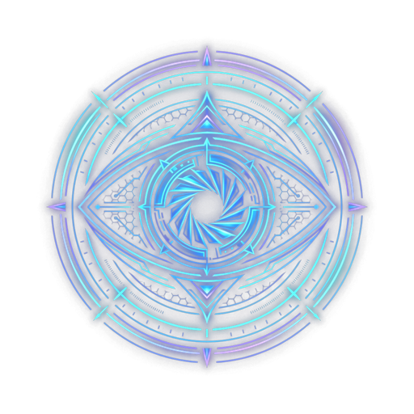

# OCULUS ENGINE // The Spatial Perception, Saccadic Gaze & Foveal Compression Eye

<p align="center">
  
</p>

<p align="center">
  <strong>The First Topological Vision & Foveal Compression Engine for AI Agents.</strong><br>
  <em>Saccadic Gaze, AST Dependency Graphs, and Pre-Inference Sensory Calibration.</em>
</p>

<p align="center">
  
  
  
  
</p>

---

## 👁️ The Fourth Pillar: Why AI Agents Need Eyes

Before OCULUS, even the most advanced LLMs suffered from **Topological Blindness**:
To understand a codebase, agents like Claude or Cursor were forced to swallow 50,000+ tokens of raw file dumps through a narrow straw. This causes:
1. Massive context window saturation and token burn.
2. Attention dilution and lost-in-the-middle degradation.
3. Garbage In $\implies$ Garbage Out.

**In biological organisms, 80% of information is filtered and compressed by the retina before it reaches the brain.**

OCULUS acts as the **topological retina for AI agents**: it maps AST dependency trees in milliseconds and projects a **Foveal Gaze** (1-2% critical junction in high-res, with peripheral dependencies reduced to zero-token skeletons).

---

## 🔬 The Cybernetic Tetrad: The Complete Living Loop

```
                       EXTERNAL REALITY (Codebase, AST, Git, Web)
                                      │
                                      ▼
             ┌────────────────────────────────────────────────┐
             │                 1. OCULUS (Vista)              │
             │   Mappa Topologica AST, Grafo e Fovea Spaziale │
             └────────────────────────┬───────────────────────┘
                                      │ Stimolo Compresso a Bassa Entropia (0 Token)
                                      ▼
             ┌────────────────────────────────────────────────┐
             │                 2. ANIMA (Mente)               │
             │   Fase di Feynman & Calcolo di Minima Azione   │
             └────────────────────────┬───────────────────────┘
                                      │ Flusso di Risonanza & Segnali di Stress
                                      ▼
             ┌────────────────────────────────────────────────┐
             │                 3. CORIS (Cuore)               │
             │   Omeostasi, Emodinamica e Memoria Linfatica   │
             └────────────────────────┬───────────────────────┘
                                      │ Decisione Certificata & Filtro Anticorpale
                                      ▼
             ┌────────────────────────────────────────────────┐
             │                 4. DEMON (Muscolo)             │
             │   Esecuzione Deterministica & Sandbox OS       │
             └────────────────────────┬───────────────────────┘
                                      │
                                      ▼
                       AZIONE SUL MONDO REALE
```

---

## ⚡ Key Architectural Features

### 1. Saccadic Gaze & Foveal Vision
The human eye does not render 180° in 4K; only the fovea has sharp focus.
* **Focal Point**: Extracts only the exact AST class/function slice needed for the current task.
* **Peripheral Vision**: Skeletons of imports and signatures passed as compact structural metadata.
* **Result**: **85% to 95% reduction in token consumption** with zero loss of semantic precision.

### 2. The Sensory Calibration Proxy for ANIMA
Solves the black-box logit dilemma of closed models (Claude/GPT):
OCULUS calculates the **Shannon Entropy $\mathcal{H}_{source}$** and **Cyclomatic Complexity** of the target code *before* inference, providing ANIMA with exact tuning parameters:
* `action_beta`: Calibrated variational phase sensitivity.
* `phase_jitter_limit`: Tailored threshold for early hallucination pruning.

---

## 🤖 Model Context Protocol (MCP) Server

OCULUS exposes a stdio JSON-RPC 2.0 server (`oculus_mcp.py`).

### Exposed Tools:
* **`oculus_foveal_scan`**: Ingests user intent and repository root; returns the high-res foveal junction and peripheral skeletons (85-95% token savings).
* **`oculus_project_ast_graph`**: Extracts structural topology (classes, functions, cyclomatic complexity, call graph) in $<10\text{ ms}$.
* **`oculus_calibrate_sensory_proxy`**: Analyzes code entropy and provides tuning parameters for ANIMA.
* **`oculus_inspect_symbol`**: Surgical inspection of any function or class symbol.

### Claude Code CLI Setup
```bash
claude mcp add oculus-engine python c:/Users/stree/Desktop/Oculus-Engine/oculus_mcp.py
```

### Full Tetrad MCP Configuration (`mcp.json` for Cursor / Windsurf)
```json
{
  "mcpServers": {
    "oculus-engine": {
      "command": "python",
      "args": ["c:/Users/stree/Desktop/Oculus-Engine/oculus_mcp.py"]
    },
    "anima-engine": {
      "command": "python",
      "args": ["c:/Users/stree/Desktop/Anima-Engine/anima_mcp.py"]
    },
    "coris-engine": {
      "command": "python",
      "args": ["c:/Users/stree/Desktop/Coris-Engine/coris_mcp.py"]
    },
    "demon-engine": {
      "command": "python",
      "args": ["c:/Users/stree/Desktop/Demon-Engine/demon_mcp.py"]
    }
  }
}
```

---

## 🧪 Benchmark Verification

Run the full validation suite:
```bash
python test_oculus_engine.py
```

* **4/4 Tests Passed in 0.017s**: AST parsing, saccadic gaze, token compression (>79%), and sensory proxy calibration.

---

## 📄 License
MIT License. Developed by Raffaele Di Tullo.
